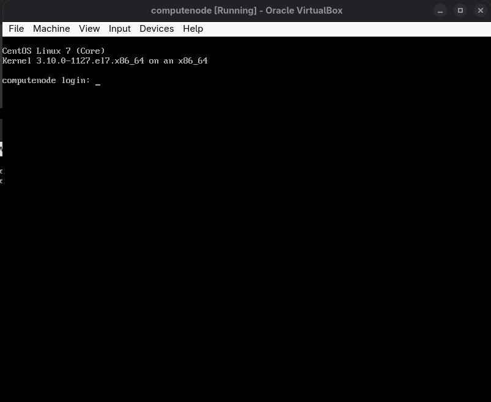

# xCAT Virtual Lab Automation

This repository provides two fully automated approaches for building an [xCAT](https://xcat.org/) (Extreme Cluster Administration Toolkit) management node and provisioning diskless CentOS 7 compute nodes in a virtualized lab environment using VirtualBox and Vagrant.




---


## 📁 Project Structure

```
xCat/
├── xcat-ansible/     # Ansible-based automation (recommended for flexibility)
├── xcat-bootstrap/   # Bash-based automation (simple and direct)
└── README.md         # This file (parent readme)
```

---

## 🚀 What’s Included?

- **xcat-ansible/**  
  Uses Vagrant and Ansible for a modern, fully automated xCAT lab setup.  

- **xcat-bootstrap/**  
  Uses Vagrant and Bash scripts for a straightforward, script-driven setup.  


Both approaches:
- Set up an Ubuntu 18.04 management node VM with xCAT
- Provision a diskless CentOS 7 compute node via PXE boot
- Automate all networking, DHCP, TFTP, and OS image steps

---

## 🛠️ Requirements

- **VirtualBox** (latest version recommended)
- **Vagrant**
- **(For Ansible version)** Ansible

---

## 📚 How to Use

1. **Choose your preferred automation:**
   - [xcat-ansible/](./xcat-ansible/readme.md) – *Ansible-based, flexible, recommended*
   - [xcat-bootstrap/](./xcat-bootstrap/readme.md) – *Bash-based, simple, quick*

2. **Follow the README in your chosen folder for step-by-step instructions.**
   - Each README covers prerequisites, setup, compute node creation, troubleshooting, and customization.

---

## 🖥️ Lab Topology

```
Host Machine
├── Management Node VM (192.168.56.10)
│   ├── xCAT Services (DHCP, DNS, TFTP, HTTP)
│   └── CentOS 7 Repository & Diskless Images
└── Compute Node VM (192.168.56.6)
    └── PXE Boot → Diskless CentOS 7
```

---

## 🔧 Customization

- Both approaches allow you to:
  - Change network ranges and node IPs
  - Add more compute nodes
  - Adjust VM resources (RAM, CPU)
  - Use your own CentOS ISO or OS images

See the respective folder README for details.

---


