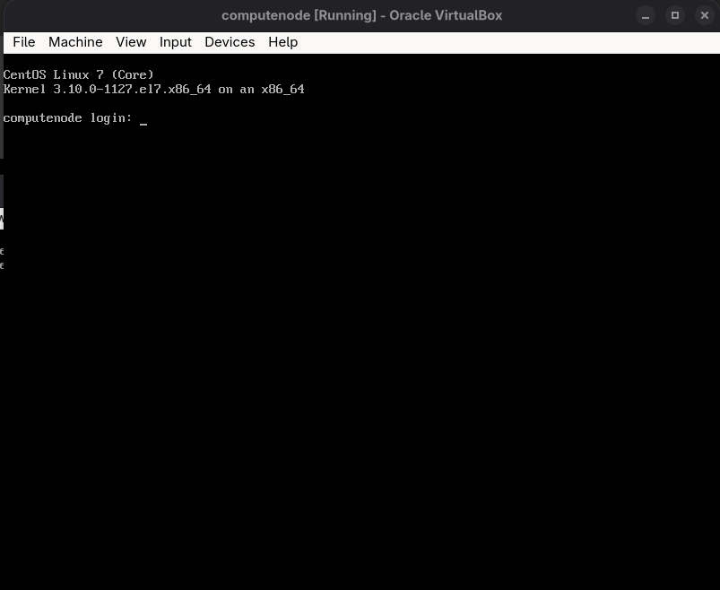

# xCAT Ansible Management Node Setup

Easily automate your xCAT (Extreme Cluster Administration Toolkit) lab! This project uses **Vagrant**, **Ansible**, and **VirtualBox** to set up a management node and provision diskless CentOS 7.8 compute nodes via PXE boot—all with just a few commands.



---

## 📚 Table of Contents

- [Overview](#overview)
- [Prerequisites](#prerequisites)
- [Quick Start](#quick-start)
- [Step-by-Step Guide](#step-by-step-guide)
- [Compute Node Automation](#compute-node-automation)
- [How It Works](#how-it-works)
- [Verification](#verification)
- [Troubleshooting](#troubleshooting)
- [Configuration & Customization](#configuration--customization)

---

## 🎯 Overview

This project gives you a **repeatable, fully automated lab** for xCAT, including:

- **Management Node**: Ubuntu 18.04 VM running xCAT
- **Compute Node**: Diskless CentOS 7.8 VM, PXE-booted and managed by xCAT

The setup is divided into two phases:
- **Phase 1**: Installs xCAT and prepares the management node
- **Phase 2**: Imports CentOS ISO, configures networking, and defines compute nodes

---

## 🛠️ Prerequisites

**Software:**
- [VirtualBox](https://www.virtualbox.org/)
- [Vagrant](https://www.vagrantup.com/)
- [Ansible](https://www.ansible.com/)
- `wget` or `curl`

**Hardware:**
- **Host Machine**: 8GB+ RAM, 50GB+ free disk space

**Network:**
- Uses VirtualBox Host-Only network: `192.168.56.0/24`
    - Management Node: `192.168.56.10`
    - Compute Node: `192.168.56.6`
    - DHCP Range: `192.168.56.100-192.168.56.200`

---

## 🚀 Quick Start

1. **Clone or create your project directory:**
    ```bash
    mkdir xcat-ansible && cd xcat-ansible
    vagrant init
    ```

2. **Replace the generated `Vagrantfile`** with the one provided in this repo.

3. **Start the management node (Phase 1 runs automatically):**
    ```bash
    vagrant up
    ```

4. **Copy the CentOS ISO to the VM:**
    ```bash
    chmod +x copy-iso.sh
    ./copy-iso.sh
    ```

5. **Complete the setup (Phase 2):**
    ```bash
    vagrant provision --provision-with phase2
    ```

6. **Create and boot the compute node VM:**
    ```bash
    chmod +x create-compute-vm.sh boot-compute-vm.sh
    ./create-compute-vm.sh
    ./boot-compute-vm.sh
    ```

---

## 📝 Step-by-Step Guide

### 1. Project Initialization

```bash
mkdir xcat-ansible
cd xcat-ansible
vagrant init

```

### 2. Vagrantfile

Replace the generated `Vagrantfile` with the `Vagrantfile` provided


### 3. Supporting Files

Make sure you have:
- `site.yml` (Ansible playbook)
- `group_vars/all.yml` (variables)
- `copy-iso.sh`, `create-compute-vm.sh`, `boot-compute-vm.sh` (helper scripts)

### 4. Start the Management Node

```bash
vagrant up
```
- Installs xCAT and dependencies
- Sets up networking and core services

### 5. Copy CentOS ISO

```bash
chmod +x copy-iso.sh
./copy-iso.sh
```
- Downloads ISO if missing
- Copies it to `/isos` on the management node

### 6. Complete xCAT Setup

```bash
vagrant provision --provision-with phase2
```
- Imports ISO, generates OS images, configures DHCP/TFTP/HTTP, defines compute node

---

## 🖥️ Compute Node Automation

You can automate compute node creation and booting with the included scripts:

### 1. Create the Compute Node VM

```bash
chmod +x create-compute-vm.sh
./create-compute-vm.sh
```
- Creates a VirtualBox VM named `computenode` with MAC `08:00:27:AB:CD:EF` on the host-only network

### 2. Boot the Compute Node VM

```bash
chmod +x boot-compute-vm.sh
./boot-compute-vm.sh
```
- PXE boots from the management node and loads the diskless CentOS image

---

## ⚙️ How It Works

- **Phase 1**: Installs and configures xCAT on Ubuntu, sets up networking and services
- **Phase 2**: Imports CentOS ISO, generates diskless OS images, configures DHCP/TFTP/HTTP, and defines compute nodes

**Expected output after Phase 2:**
```
🎉 xCAT MANAGEMENT NODE READY! 🎉
✅ Management Node: 192.168.56.10
✅ Compute Node: computenode (192.168.56.6)
✅ Network Interface: enp0s8
✅ MAC Address: 08:00:27:AB:CD:EF
🚀 READY TO BOOT COMPUTE VM!
```

---

## ✅ Verification

**Check management node services:**
```bash
vagrant ssh
sudo systemctl status xcatd isc-dhcp-server apache2 atftpd bind9
source /etc/profile.d/xcat.sh
lsdef -t node
lsdef -t network
lsdef -t osimage
```

**Test network services:**
```bash
# TFTP
echo -e "binary\nget xcat/xnba.kpxe\nquit" | tftp 192.168.56.10

# HTTP
curl -I http://192.168.56.10/tftpboot/xcat/osimage/centos7.8-x86_64-netboot-compute/kernel

# DNS
nslookup computenode.local 192.168.56.10
```

---

## 🛠️ Troubleshooting

**Common issues and fixes:**

- **DHCP server failed to start:**  
  Check config:  
  `sudo dhcpd -t -cf /etc/dhcp/dhcpd.conf`  
  Restart:  
  `sudo systemctl restart isc-dhcp-server`

- **Compute node not getting IP:**  
  Check leases:  
  `sudo cat /var/lib/dhcp/dhcpd.leases`  
  Check logs:  
  `sudo journalctl -u isc-dhcp-server -f`

- **TFTP boot failure:**  
  Test manually:  
  `tftp 192.168.56.10`  
  `get xcat/xnba.kpxe`

- **OS image generation failed:**  
  Check:  
  `ls -la /install/netboot/centos7.8/x86_64/compute/`  
  Regenerate:  
  `source /etc/profile.d/xcat.sh && genimage centos7.8-x86_64-netboot-compute`

**Log files:**
- `/var/log/xcat/`
- `journalctl -u isc-dhcp-server`
- `/var/log/apache2/`
- `journalctl -u atftpd`

---

## ⚙️ Configuration & Customization

- **Network:**  
  - Management: `192.168.56.10`  
  - Compute: `192.168.56.6`  
  - DHCP Range: `192.168.56.100-192.168.56.200`

- **Default Credentials:**  
  - Root password: `cluster` (configurable in `group_vars/all.yml`)
  - SSH: Key-based from management node

- **Key files:**  
  - `/etc/profile.d/xcat.sh`  
  - `/etc/dhcp/dhcpd.conf`  
  - `/etc/bind/`  
  - `/tftpboot/`  
  - `/var/www/html/`

- **Customize:**  
  Edit `group_vars/all.yml` for:
  - IP addresses and networks
  - Node configs
  - xCAT/OS versions

---

