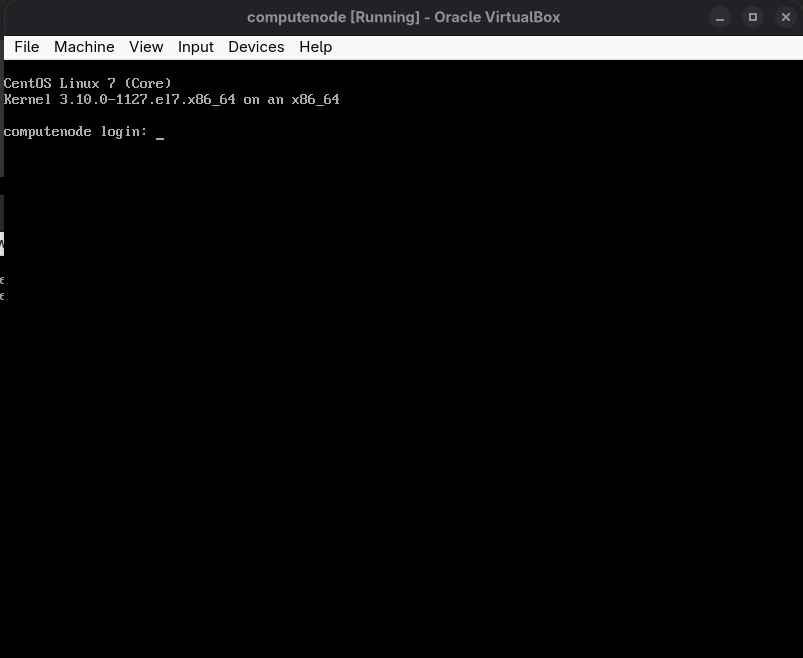

# xCAT Automated Lab Setup

Easily set up an xCAT (Extreme Cluster Administration Toolkit) management node and provision diskless CentOS 7 compute nodes using **Vagrant** and **VirtualBox**. This project provides a fully automated, repeatable lab environment—no manual PXE or network setup required!




---

## 📚 Table of Contents

- [Overview](#overview)
- [Prerequisites](#prerequisites)
- [Quick Start](#quick-start)
- [Step-by-Step Guide](#step-by-step-guide)
- [Compute Node Automation](#compute-node-automation)
- [Verification](#verification)
- [Troubleshooting](#troubleshooting)
- [Configuration & Customization](#configuration--customization)

---

## 🎯 Overview

This setup creates:
- **Management Node**: Ubuntu 18.04 VM running xCAT services
- **Compute Node**: Diskless PXE-booted CentOS 7 node managed by xCAT

The process is divided into two phases:
- **Phase 1**: Installs xCAT and prepares the management node
- **Phase 2**: Imports CentOS ISO, configures networking, and defines compute nodes

---

## 🛠️ Prerequisites

**Software:**
- [VirtualBox](https://www.virtualbox.org/)
- [Vagrant](https://www.vagrantup.com/)

**Required Files:**
- **CentOS 7 ISO**: `CentOS-7-x86_64-DVD-2003.iso` (4.4GB)
  - Will be downloaded automatically if not present
  - Or download manually from: https://ftp.iij.ad.jp/pub/linux/centos-vault/7.8.2003/isos/x86_64/


**Network:**
- Uses VirtualBox Host-Only network: `192.168.56.0/24`
    - Management Node: `192.168.56.10`
    - Compute Node: `192.168.56.6`
    - DHCP Range: `192.168.56.100-192.168.56.200`

---

## 🚀 Quick Start

### 1. Initialize Project

```bash
mkdir xcat-lab && cd xcat-lab
vagrant init
```

### 2. Configure Vagrantfile

Replace the generated `Vagrantfile` with the `Vagrantfile` provided


### 3. Download Required Scripts

Download these scripts to your project directory:
- `bootstrap-phase1.sh` – xCAT installation and basic setup
- `bootstrap-phase2.sh` – ISO import and final configuration
- `copy-iso.sh` – ISO copy utility
- `create-compute-vm.sh` – Compute VM creation script
- `boot-compute-vm.sh` – Compute VM boot script

---

## 📝 Step-by-Step Guide

### 1. Start the Management Node

```bash
vagrant up
```
- Installs xCAT and dependencies
- Sets up networking and core services

### 2. Copy CentOS ISO

```bash
chmod +x copy-iso.sh
./copy-iso.sh
```
- Downloads ISO if missing
- Copies it to `/isos` on the management node

### 3. Complete xCAT Setup

```bash
vagrant provision --provision-with phase2-copy,phase2-chmod,phase2-run
```
- Imports ISO, generates OS images, configures DHCP/TFTP/HTTP, defines compute node

---

## 🖥️ Compute Node Automation

You can automate compute node creation and booting with the included scripts:

### 1. Create the Compute Node VM

```bash
chmod +x create-compute-vm.sh
./create-compute-vm.sh
```
- Creates a VirtualBox VM named `computenode` with MAC `08:00:27:AB:CD:EF` on the host-only network

### 2. Boot the Compute Node VM

```bash
chmod +x boot-compute-vm.sh
./boot-compute-vm.sh
```
- PXE boots from the management node and loads the diskless CentOS image

---

## ✅ Verification

**Check management node services:**
```bash
vagrant ssh
sudo systemctl status xcatd isc-dhcp-server apache2 atftpd bind9
source /etc/profile.d/xcat.sh
lsdef -t node
lsdef -t network
lsdef -t osimage
```

**Test network services:**
```bash
# TFTP
echo -e "binary\nget xcat/xnba.kpxe\nquit" | tftp 192.168.56.10

# HTTP
curl -I http://192.168.56.10/tftpboot/xcat/osimage/centos7.8-x86_64-netboot-compute/kernel

# DNS
nslookup computenode.local 192.168.56.10
```

---

## 🛠️ Troubleshooting

**Common issues and fixes:**

- **Phase 1 takes too long:**  
  Check progress:  
  `vagrant ssh -c "tail -f /var/log/dpkg.log"`  
  If stuck:  
  `vagrant reload && vagrant provision`

- **ISO copy fails:**  
  Check VM status:  
  `vagrant status`  
  Try manual copy:  
  `vagrant ssh -c "sudo cp /vagrant/CentOS-7-x86_64-DVD-2003.iso /isos/"`

- **Phase 2 fails:**  
  Check xCAT daemon:  
  `vagrant ssh -c "sudo systemctl status xcatd"`  
  Run Phase 2 manually:  
  `vagrant ssh && sudo su - root && source /etc/profile.d/xcat.sh && /tmp/bootstrap-phase2.sh`

- **Compute node won't boot:**  
  Check DHCP logs:  
  `vagrant ssh -c "sudo tail -f /var/log/dhcp/dhcpd.log"`  
  Check TFTP:  
  `vagrant ssh -c "sudo netstat -tulpn | grep tftp"`  
  Check HTTP:  
  `vagrant ssh -c "curl -I http://192.168.56.10/tftpboot/xcat/xnba.kpxe"`

---

## ⚙️ Configuration & Customization

- **Network:**  
  - Management: `192.168.56.10`  
  - Compute: `192.168.56.6`  
  - DHCP Range: `192.168.56.100-192.168.56.200`

- **Default Credentials:**  
  - Management Node: `vagrant/vagrant`
  - Compute Node: `root/abc123` (set by xCAT)

- **Key files:**  
  - `/etc/profile.d/xcat.sh`  
  - `/etc/dhcp/dhcpd.conf`  
  - `/etc/bind/`  
  - `/tftpboot/`  
  - `/var/www/html/`

- **Customize:**  
  Edit `bootstrap-phase2.sh` for:
  - IP addresses and networks
  - Node configs
  - xCAT/OS versions

---
